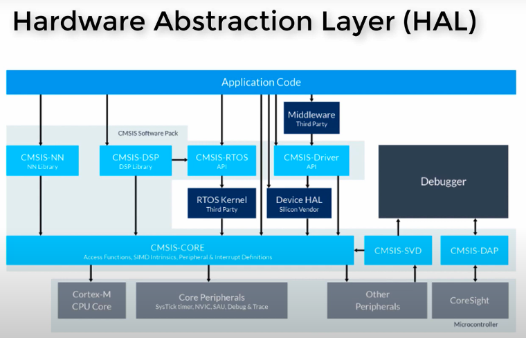

<!-- _class: lead -->

# ENSE 452
## Embedded and Real-Time Software Systems - Laboratory

👨‍💻 SSE Lab Instructor: [Trevor Douglas](mailto:trevor.douglas@uregina.ca)

---

## Lab 1: Introduction to the hardware and software tools

### Pre reqs
What you know.
- Familiarity with Nucleo-64 Board or the STM32F1X series
- C/C++
- Keil µVision

What possibly is new?
- Git /GitHub
- RTOS
- Real time requirements

---

## Documentation

Many documents are available on urcourses, under Class Resources in the ARM STMicro Docs folder.  Some of the most useful are listed below. There may be updated versions of these documents available online, which you are welcome to substitute.

- STM32CubeIDEUserManual: UM2609
- STM32 Programmer's Manual: PM0056
- STM32 Reference Manual: RM0008
- Nucleo Board Schematic: MB1136
- STM32 HAL User Manual: UM1850
- STM32F103RB Data Sheet

---

## Equipment and Software Requirements}

Our target board is the Nucleo-64, and it has a lot of fun peripherals. The brain of this board is a STMicro STM32F103RB microcontroller, with 128 KiB of Flash, and 20 KiB of RAM and a 72MHz clock.

- PC for development.
- STM32CubeIDE Software 1.17.0 (I am using Windows in the lab). 
- NOTE ** If you want to use the latest version for Mac or other platforms you must also use STM32CubeMX for code generation.
- Nucleo-64 development board and USB Serial cable.
- Git (Git client or use command line).

---
## HAL
<table>
  <tr>
    <td> </td>
  </tr>
</table>

---
## Objective

The objective of this lab is to get you started using the STM32CubeIDE and program the Nucleo-64 board to understand how to develop software for this target. You will also put your project under source control (revision control). First you'll get the LED on the board to blink at a certain rate. As you build your code make sure to commit changes and push to your repository as that is where your code will be evaluated.

